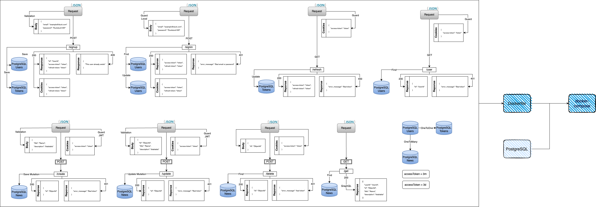

# Backend test task

Architecture:


## Table of contents

- [Description](#description)
- [Technologies](#technologies)
- [Structure](#structure)
- [Installation](#installation)


## Description
This task includes Monolith architecture along with OAuth2.0 for user authorization, other details you can see above.

## Technologies
- Node.js
- NestJS (passport, passport-local, passport-jwt)
- TypeORM
- GraphQL
- ...other packages

## Installation
#### Installation by docker

(NOTE: make sure that you have created postgres image)

(NOTE: the provided code is created for docker installatioin, not for locally use, if you want to make an install by local machine - read below)
```bash
$ docker login

$ docker compose up
```

#### Installation by local machine
(NOTE: in .env change POSTGRES_HOST=localhost)
```bash
$ yarn install

$ yarn start:dev
```


